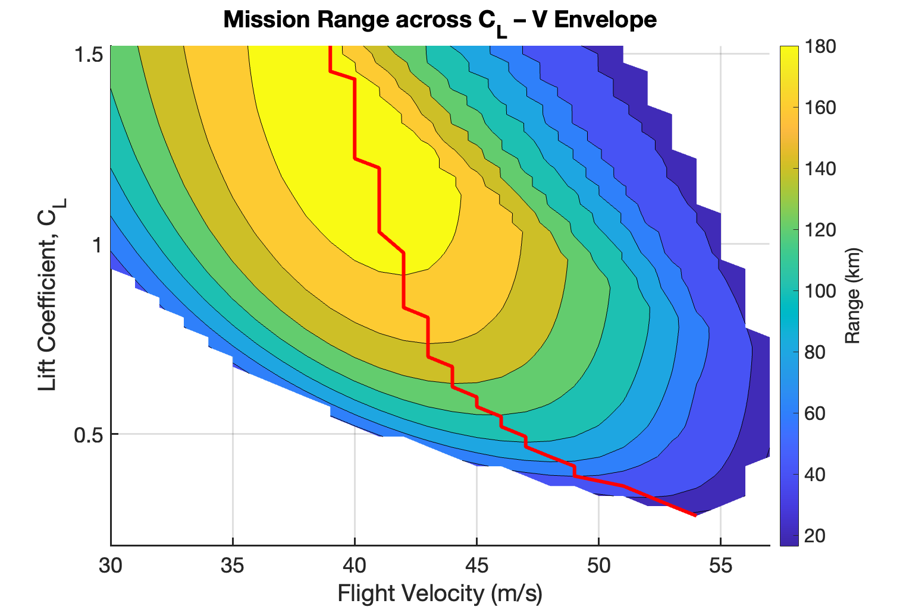
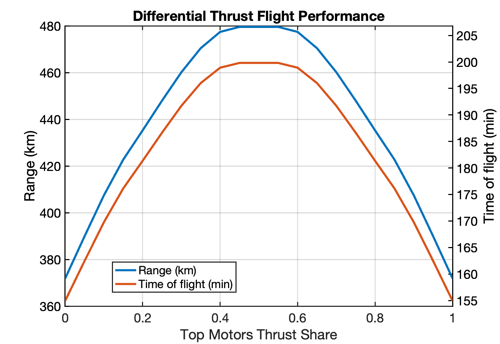
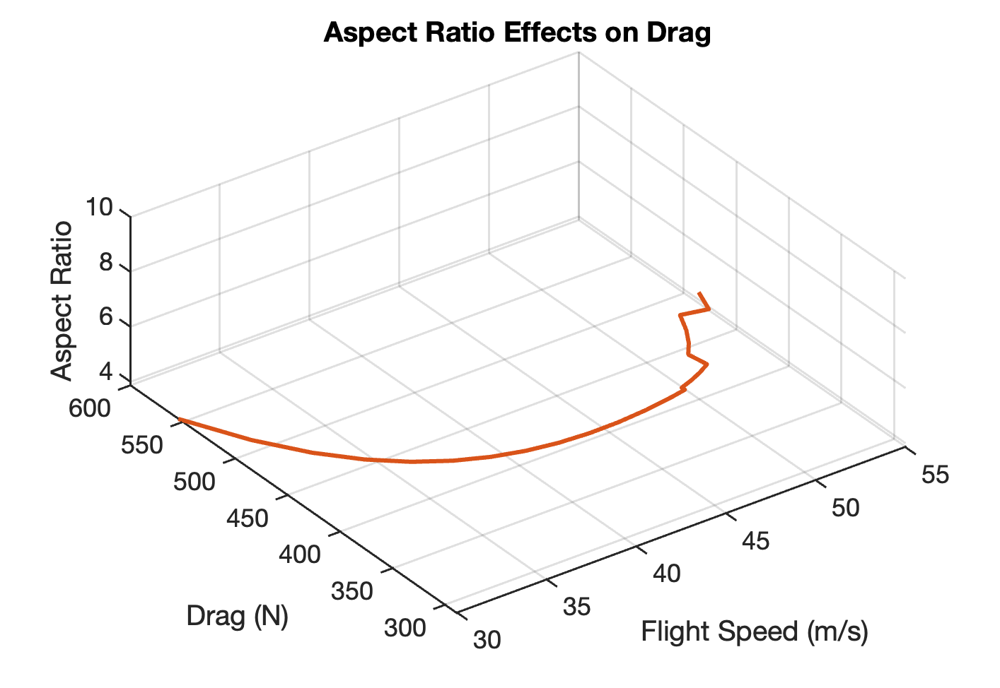
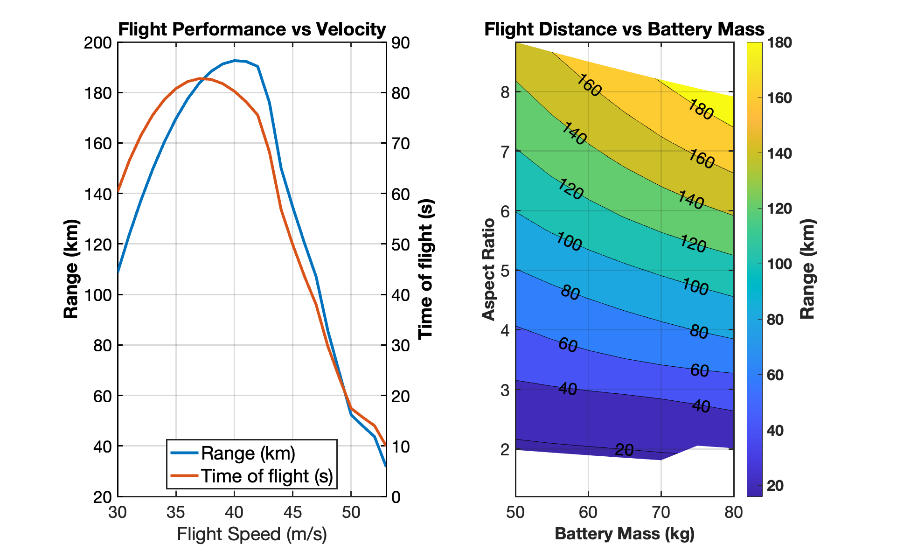

# 🚀 X-Wing Biplane Optimisation

[](LICENSE)


A **MATLAB®** toolbox for sizing, analysing & visualising **X-Wing Biplanel** electric VTOL/CTOL aircraft.  
It unifies aerodynamic & structural sizing, propulsion constraints, battery trade-offs and full mission optimisation, wrapping the results in publication-quality plots.  
Every solver has a `_with_comments` twin—so the maths is never a black box.  
*Need a mental picture?* See an X-wing biplane concept from **[Salvos Technologies](https://www.linkedin.com/company/salvos-technologies)**.

---

## 📚 Table of Contents
1. [Summary](#summary)  
2. [Key Features](#key-features)  
3. [Example Results](#example-results)  
4. [Switching to a Single-Wing Layout](#switching-to-a-single-wing-layout)  
5. [Requirements](#requirements)  
6. [Installation](#installation)  

---

## 📝 Summary
* **Design-space exploration** – sweep span, battery mass, \(C_L\), airspeed, AoA, differential-thrust split, etc.  
* **Instant trade-offs** – built-in scripts spit out range maps, drag curves and Pareto fronts.  
* **Full transparency** – every core file has an annotated variant (`*_with_comments.m`) explaining each equation line-by-line.

---

## ✨ Key Features

| Module | Purpose |
| ------ | ------- |
| **`Main.m`** | Sets constraints & launches a complete optimisation run. |
| **`OptFun.m`** | Global mission optimiser – sweeps \(C_L\) & velocity, returns range/endurance maps & Pareto front. |
| **`VelOpt.m`** | Optimiser at **fixed AoA** plus differential-thrust analysis. |
| **`compute_vmax_prop.m`** | Propeller speed limits from tip-Mach & max advance ratio. |
| **`sizeWingChord*.m`** | Mean chord & wing mass for one span/weight pair – plus grid wrapper. |
| **`wing_weight_finder.m`** | Spar, rib & skin mass breakdown for a rectangular wing box. |
| **`plot_*.m`** | Converts optimiser output into publication-ready figures. |

> **Quick taste:** run **`examples/demo_random_test.m`**—you’ll get speed limits in < 1 min.

---

## ✈️ Example Results

| Plot | Insight |
| ---- | ------- |
|             | **Range across \(C_L\)–Velocity envelope** &nbsp;— coloured contours + Pareto front. |
|  | **Differential-thrust split** &nbsp;— ~50/50 delivers max range & endurance (fixed CL). |
|           | **Aspect ratio vs drag** &nbsp;— induced vs profile trade (fixed CL). |
|            | **Velocity vs battery-mass** &nbsp;— range & endurance trends (fixed CL) (in minutes). |

---

## 🔀 Switching to a Single-Wing Layout

By default the model assumes an **X-wing/biplane**.  
For a *single*, flat wing change just three lines in `Main.m`:

| Purpose | Parameter | Old value | New value |
|---------|-----------|-----------|-----------|
| Remove X-wing “kink” | `thetaDeg` | `5` ° | `0` |
| Zero in-board fold   | `length_x` | `2.0` m | `0` |
| One wing instead of two | `b` (span) & `Cross_section_N`| `10` m & `8`| `5` m & `4`|

```matlab
% Main.m – switch to single, flat wing
thetaDeg = 0;   % no dihedral break
length_x = 0;   % no in-board fold
b        = b/2; % single wing, not biplane
Cross_section_N = Cross_section_N/2; % single wing, not biplane
```
---
## 📋 Requirements

| Software / Add-on | Version / Note |
| ----------------- | -------------- |
| **MATLAB** | **R2022b** or newer (uses `table`, `pchip`, `tiledlayout`, …) |
| **Aerospace Toolbox** *(optional)* | Only for ISA helper functions |

---

## ⚙️ Installation

```bash
# 1 · Clone the repository
git clone https://github.com/TomyCabrer/X-wing_biplane_Opt.git

# 2 · Add source folder to the MATLAB path (non-interactive)
matlab -batch "addpath(genpath(fullfile(pwd,'src'))); savepath"
